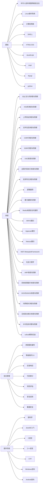

```mermaid
graph LR
	基础-->中华人民共和国网络安全法
	基础-->Linux操作系统
	基础-->计算机网络
	基础-->SHELL
	基础-->HTML/CSS
	基础-->JavaScript
	基础-->PHP
	基础-->Mysql
	基础-->python
	渗透-->SQL注入的渗透与防御
	渗透-->XSS的渗透与防御
	渗透-->上传验证渗透与防御
	渗透-->文件包含渗透与防御
	渗透-->CSRF渗透与防御
	渗透-->SSRF渗透与防御
	渗透-->XXE渗透与防御
	渗透-->远程代码执行渗透与防御
	渗透-->反序列化渗透与防御
	渗透-->逻辑漏洞
	渗透-->暴力破解与防御
	渗透-->Redis未授权访问漏洞
	渗透-->AWVS漏扫
	渗透-->Appscan漏扫
	渗透-->Nessus漏扫
	渗透-->MSF-MetasploitFramework
	渗透-->社会工程学
	渗透-->ARP渗透与防御
	渗透-->系统权限提升渗透与防御
	渗透-->DOS与DDOS渗透与防御
	渗透-->内网相关渗透与防御
	渗透-->无线安全相关渗透与防御
	渗透-->木马免杀问题与防御
	渗透-->vulhub靶场实战
	安全管理-->渗透报告编写
	安全管理-->等级保护2.0
	安全管理-->应急响应
	安全管理-->代码审计
	安全管理-->风险评估
	安全管理-->安全巡检
	安全管理-->数据安全
	提升阶段-->密码学
	提升阶段-->JavaSE入门
	提升阶段-->C语言
	提升阶段-->C++语言
	提升阶段-->CTF
	提升阶段-->Windows逆向
	提升阶段-->Android逆向
	
```

